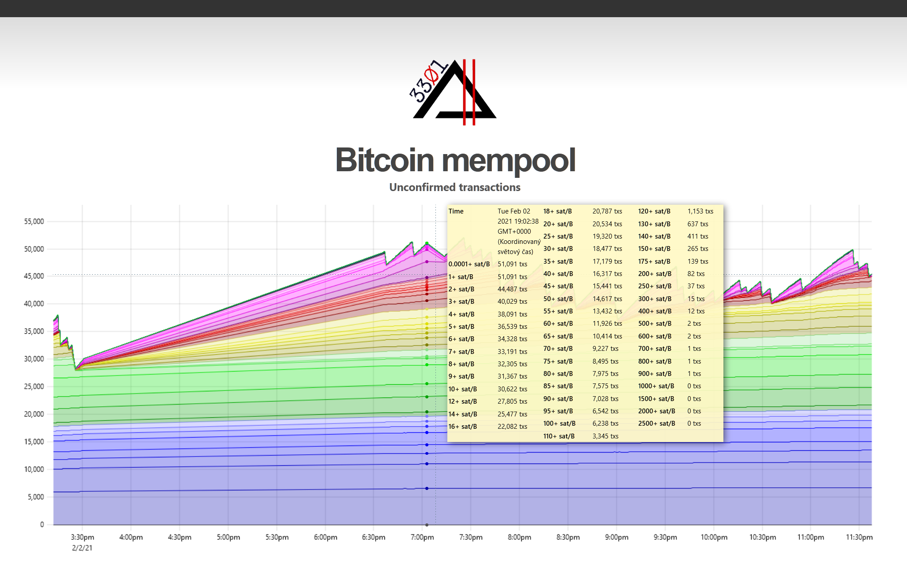

# BTC mempool visualiser



Experimental project.

---

Project consists from 5 parts:
- Bitcoin pruned node (1024MB)
- PostgreSQL as the extracted data storage
- Deno-based JSON-RPC Bitcoin mempool extractor
- Deno-based static website generator (+ mempool output from DB as a static file)
- nginx for website serving (read-only mode)

## Run

1. Clone this repo.
2. Generate usernames & passwords and update `btc.env` & `db.env` accordingly.
3. Run with
```sh
$ docker-compose up -d
```
4. Wait few days to fully sync the Bitcoin node.
```sh
$ docker-compose logs -f --tail=50 btc-node
```
5. nginx running at port 8050 externally, can be changed in `docker-compose.yml`.


### Check the logs

```sh
$ docker-compose logs -f --tail=50
```

### Notes

If you already run your bitcoin node with RPC enabled & configured, simply comment the `btc-node` service in `docker-compose.yml`.

## Credits

Inspired by [https://github.com/jhoenicke/mempool](https://github.com/jhoenicke/mempool).

Thanks to the developers of the [uPlot library](https://github.com/leeoniya/uPlot/tree/master/docs).
